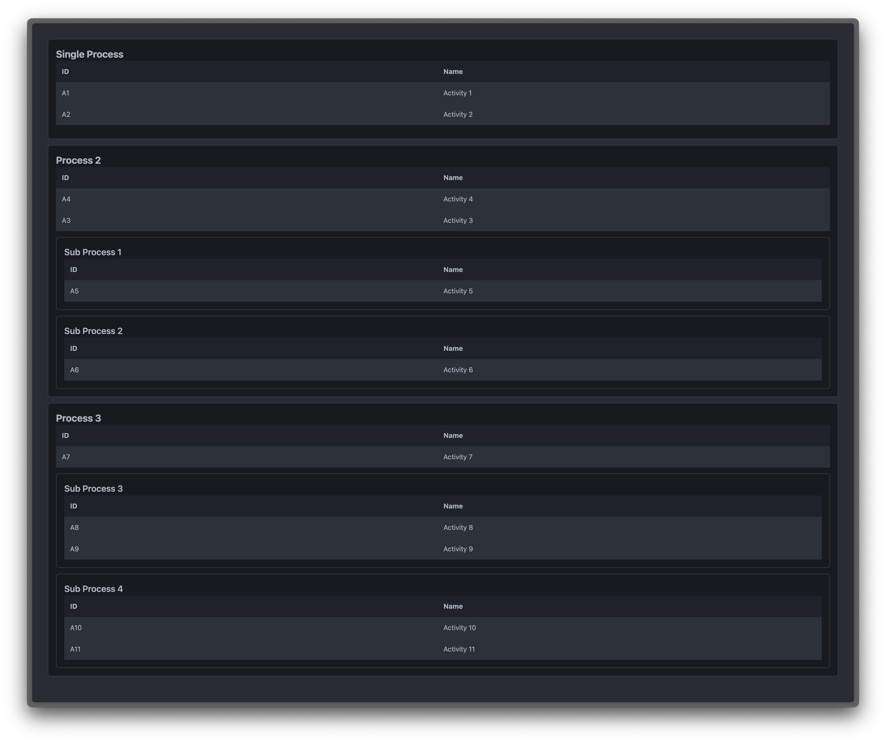

# Three-Layer Nested Drag and Drop with @dnd-kit

This project implements a three-layer nested drag-and-drop system using the powerful [@dnd-kit](https://dndkit.com/) library. The layers are structured as follows:

1. **Process**
2. **SubProcess**
3. **Item**



> *Above: A preview of the drag-and-drop interface showcasing Processes, SubProcesses, and Items in action.*

---

### Key Features

- **Drag and Drop Across Layers**:
  - **Items** can be moved between **SubProcesses** and across **Processes**.
  - **SubProcesses** containing **Items** can be moved across **Processes** while preserving their contained **Items**.
  - **Processes** containing **SubProcess** and **Items** can be re-ordered while preserving their contained **SubProcesses** and **Items**
  - *Note (Additional Condition)*: 
    - **SubProcesses** cannot move into the first **Single Process**
    - **Single Process** is fixed to the first position and cannot re-order

- Built with modern tools:
  - **Vite** for fast and efficient development.
  - **React** for the UI components.
  - **bun** for dependency management and running the project.

---

## Getting Started

### Prerequisites

Ensure you have the following installed:

- [bun](https://bun.sh/) - A modern JavaScript runtime (used to manage and run the project).
- Node.js (optional but recommended).
- Git.

### Installation

1. Clone the repository:
```bash
  git clone <repository-url>
  cd <project-directory>
```

2. Install dependencies using bun:
```bash
  bun install
```

3.Start the development server:
```bash
  bun dev
```

4. Open your browser and navigate to http://localhost:5173 (default Vite port).

---
## Technologies Used

- **[@dnd-kit](https://dndkit.com/)**: For implementing drag-and-drop interactions.
- **React**: For building the user interface.
- **Vite**: For bundling and running the development server.
- **bun**: For efficient dependency management and scripting.
- **[Tailwind CSS](https://tailwindcss.com/)**: For styling the interface with a utility-first CSS framework.
